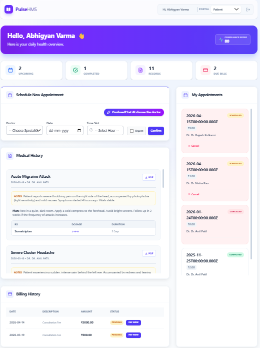

# Pulse HMS — Hospital Management System

  
  
  
  
  
  
  
  
  

Pulse HMS is a production-grade, full-stack healthcare platform designed to streamline hospital operations. It implements secure authentication, transactional workflows, and role-based portals for **Doctors**, **Receptionists**, and **Patients**.

The system focuses on real-world hospital workflows such as appointment scheduling, billing, inventory tracking, prescription management, and digital medical records.

---

## Key Features

### Architecture, Security & Infrastructure

**MVC Backend Architecture**
- Modular Node.js and Express backend
- Structured architecture using:/routes,/controllers,/utils,/config
- Designed for scalability and maintainability

**Real-Time WebSocket Engine**
- Powered by Socket.io for instantaneous UI updates
- Live inventory tracking and automated stock deductions
- Real-time appointment status changes and doctor rating updates
- Live patient compliance score synchronization

**Cloud-Resilient Email Architecture**
- Fully decoupled Email Hub powered by EmailJS REST API
- Designed to bypass strict IPv6/SMTP firewall limitations
- Ensures reliable email delivery in cloud-hosted environments

**Universal Notification System**
Dynamic templates supporting:
- Registration OTPs
- Password Reset OTPs
- Welcome Emails
- Appointment Reminders

**Authentication & Security**
- JWT-based session management
- Bcrypt password hashing
- Time-limited OTP-based verification
- Secure password recovery workflows

---

## Doctor Portal

Designed to support clinical workflows and patient management.

- **Live analytics dashboard** tracking:
  - Average ratings (updates in real-time)
  - Patient volume
  - Completed visits

- **Smart prescription system:**
  - Automatically deducts medicines from central inventory via WebSockets
  - Maintains accurate stock records

- **AI Triage Pre-Screening:**
  - Translates raw patient symptom inputs into structured clinical terminology for rapid assessment

- **Digital medical records:**
  - Rich text editor formatting for detailed clinical notes and treatment plans
  - Secure, cloud-hosted attachments via Cloudinary for X-Rays, Lab Reports, and PDFs

- **Patient directory:**
  - Searchable patient history
  - Quick access to historical medical records

- **Compliance tracking:**
  - Compliance Score (0–100)
  - Tracks patient adherence to treatment plans

---

## Receptionist (Admin) Console

Built to manage hospital operations and administrative workflows.

- **Operational analytics:**
  - Charts displaying peak visiting hours
  - Helps optimize staffing

- **Inventory management:**
  - Real-time pharmacy stock tracking synchronized globally across the hospital network
  - Automatic updates from doctor prescriptions
  - Low-stock alerts

- **Billing system:**
  - Generate invoices
  - Track payment status (Paid / Unpaid)

- **Appointment manager:**
  - Global scheduling interface
  - Administrative controls:
    - Mark Completed
    - Cancel
    - Flag No Shows

---

## Patient Portal

Designed to improve patient accessibility and transparency.

- **Smart appointment scheduling:**
  - Book appointments within hourly slots
  - Available between 10 AM and 10 PM
  - AI-assisted raw symptom input for better doctor context

- **Conflict prevention:**
  - Prevents double booking
  - Prevents overbooking
  - Prevents past-date selection

- **Medical history access:**
  - View diagnosis records and formatted treatment plans
  - Includes medicine dosage and duration

- **Doctor transparency:**
  - View doctor ratings
  - Check specialties before booking

- **Report export:**
  - Download billing and medical summaries
  - Export format: `.txt`

---

## Tech Stack

| Component | Technology |
|-----------|------------|
| Frontend | React.js (Vite), Tailwind CSS, Lucide React, React Quill (Rich Text) |
| Backend | Node.js, Express.js, Socket.io (WebSockets) |
| Database | MySQL (Relational Database, Foreign Keys, ACID Transactions) |
| Authentication | JSON Web Tokens (JWT), Bcrypt |
| Communication | EmailJS REST API |
| File Uploads | Cloudinary (Cloud Storage), Multer |
| Hosting | Render |

---

## Security Highlights

- Role-Based Access Control (RBAC)
- JWT Authentication
- Bcrypt Password Hashing
- OTP-based Email Verification
- Transaction-safe MySQL Operations

---

## Core System Modules

- Authentication System
- Real-Time WebSocket Engine
- AI Triage System
- Appointment Scheduling
- Medical Records Management
- Billing System
- Inventory Management
- Notification System
- Analytics Dashboard

---

## Deployment

Hosted using:
- **Render** (Cloud Deployment)
- **Cloudinary** (Secure Cloud Media Storage)
- **EmailJS REST API** for communication

---

## Screenshots

### Doctor Dashboard

### Patient Portal

### Admin Console

---

## Project Goals

- Build a production-ready healthcare platform
- Demonstrate full-stack architecture design
- Implement secure authentication workflows
- Develop transactional healthcare systems
- Showcase scalable backend architecture

---

## Author

**Abhigyan**

Full-stack developer with interests in scalable systems, real-world backend architecture, and production-grade application design.
