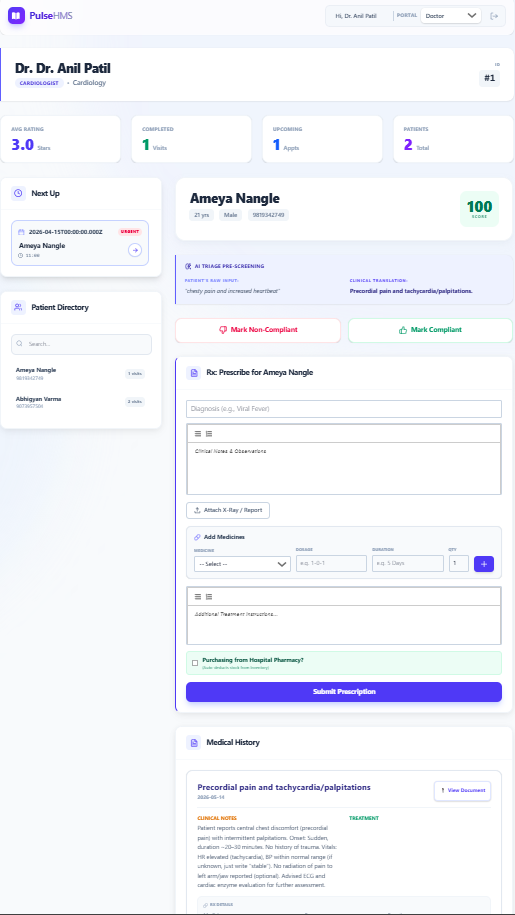
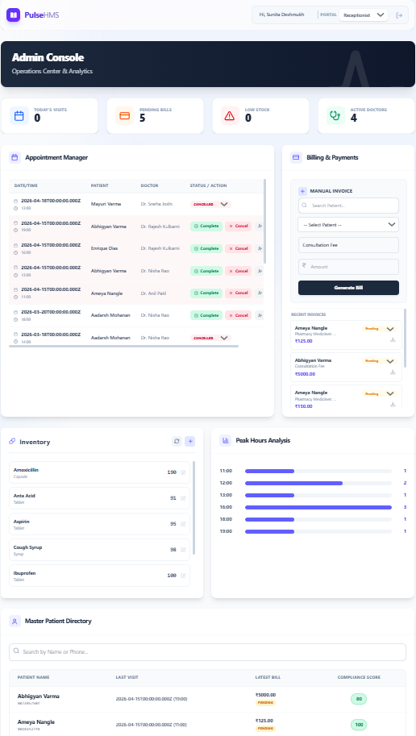

<div align="center">

#  Pulse HMS — Hospital Management System

<p>
  
  
  
  
  
  
  
  
  
</p>

A production-grade, full-stack healthcare platform designed to streamline hospital operations. Features secure authentication, transactional workflows, real-time WebSocket synchronization, and role-based portals for **Doctors**, **Receptionists**, and **Patients**.

<br />

[](https://hospital-portal-3ver.onrender.com)

</div>

---

##  Key Features

###  Architecture, Security & Infrastructure

| Feature | Description |
|---|---|
| MVC Backend Architecture | Modular Node.js/Express with `/routes`, `/controllers`, `/utils`, `/config` structure |
| Real-Time WebSocket Engine | Socket.io for live inventory tracking, appointment status changes, and compliance score sync |
| Cloud-Resilient Email Hub | Decoupled EmailJS REST API bypassing IPv6/SMTP firewall limitations |
| Universal Notification System | Dynamic templates for OTPs, password resets, welcome emails, and appointment reminders |
| Enterprise Security | JWT sessions, Bcrypt hashing, time-limited OTPs, secure password recovery |

###  Doctor Portal

- **Live analytics dashboard** — Real-time ratings, patient volume, completed visits
- **Smart prescription system** — Auto-deducts medicines from inventory via WebSockets
- **AI Triage Pre-Screening** — Translates raw symptoms into structured clinical terminology
- **Digital medical records** — Rich text editor (React Quill) for clinical notes; Cloudinary-hosted X-Rays, lab reports, PDFs
- **Patient directory** — Searchable history with quick access to records
- **Compliance tracking** — 0–100 score tracking patient adherence

###  Receptionist (Admin) Console

- **Operational analytics** — Peak visiting hour charts for staffing optimization
- **Inventory management** — Real-time pharmacy stock with automatic prescription deductions and low-stock alerts
- **Billing system** — Invoice generation with payment status tracking (Paid / Unpaid)
- **Appointment manager** — Global scheduling with controls: Mark Completed, Cancel, Flag No Shows

###  Patient Portal

- **Smart appointment scheduling** — Hourly slots (10 AM–10 PM) with AI-assisted symptom input
- **Conflict prevention** — Blocks double-booking, overbooking, and past-date selection
- **Medical history access** — View diagnoses, formatted treatment plans, dosages, and durations
- **Doctor transparency** — View ratings and specialties before booking
- **Report export** — Download billing and medical summaries as `.txt`

---

##  Tech Stack

| Component | Technology |
|---|---|
| Frontend | React 19 (Vite), Tailwind CSS, Lucide React, React Quill |
| Backend | Node.js 20+, Express.js, Socket.io |
| Database | MySQL 8.0 / TiDB Cloud (ACID transactions, foreign keys) |
| Authentication | JWT, Bcrypt, OTP verification |
| Communication | EmailJS REST API |
| File Uploads | Cloudinary (cloud storage), Multer |
| Hosting | Render |
| Scheduling | Node-Cron (background tasks) |

---

##  Security Architecture

| Layer | Implementation |
|---|---|
| Authentication | JWT-based session management with secure token refresh |
| Password Security | Bcrypt hashing with salt rounds |
| Verification | Time-limited OTP-based email verification |
| Recovery | Secure password reset workflows |
| Access Control | Role-Based Access Control (RBAC) for Doctors, Patients, Staff |
| CORS Policy | Whitelist-only domain access (local & production) |
| Rate Limiting | General API: 150 req/15 min per IP; Auth routes: strict brute-force protection |
| Data Protection | Cross-Origin Resource Policy enforced |
| File Uploads | Cloudinary secure upload with type & size validation |
| Audit Trail | Complete action logging via `auditlog` table |

---

##  Quick Start

### Prerequisites

- Node.js >= 20.0.0
- MySQL >= 8.0 (or TiDB Cloud account)
- `npm` or `yarn`

### 1. Database Setup

```bash
# Log into MySQL and initialize schema
mysql -u root -p hospital_db < hospital_db.sql
```

> **Note:** The full database schema is documented in the [Database Schema](#️-database-schema) section below.

### 2. Backend Setup

```bash
cd hospital-api
npm install
```

Create `.env` in `hospital-api/`:

```env
# Server & Database
PORT=5000
DB_HOST=localhost
DB_USER=root
DB_PASSWORD=your_mysql_password
DB_NAME=hospital_db

# Security
JWT_SECRET=your_super_secret_jwt_key

# Cloud Storage (Cloudinary)
CLOUDINARY_CLOUD_NAME=your_cloud_name
CLOUDINARY_API_KEY=your_api_key
CLOUDINARY_API_SECRET=your_api_secret
```

Start the server:

```bash
node server.js
# Or with hot reload:
npm run dev
```

### 3. Frontend Setup

```bash
cd hospital-frontend
npm install --legacy-peer-deps
```

> **Note:** `--legacy-peer-deps` is required for React 19 compatibility with React Quill.

Create `.env` in `hospital-frontend/`:

```env
# API Connection
VITE_API_BASE_URL=http://localhost:5000/api

# EmailJS Configuration (For OTPs & Notifications)
VITE_EMAILJS_SERVICE_ID=your_service_id
VITE_EMAILJS_TEMPLATE_ID=your_template_id
VITE_EMAILJS_PUBLIC_KEY=your_public_key
```

Start the dev server:

```bash
npm run dev
```

### 🌐 Application Access

| Service | URL |
|---|---|
| Frontend (UI) | http://localhost:5173 |
| Backend (API) | http://localhost:5000 |
| API Health Check | `GET http://localhost:5000/health` |

---

##  Project Structure

### Frontend (`hospital-frontend`)

```
├── public/                    # Static assets
├── src/
│   ├── components/            # Reusable UI components
│   │   ├── AddRecordForm.jsx
│   │   ├── AppointmentScheduler.jsx
│   │   ├── Card.jsx
│   │   ├── LoadingSpinner.jsx
│   │   ├── Modal.jsx
│   │   ├── Notification.jsx
│   │   ├── PatientLogin.jsx
│   │   └── StaffLogin.jsx
│   ├── pages/                 # Role-based dashboard views
│   │   ├── DoctorDashboard.jsx
│   │   ├── HomePage.jsx
│   │   ├── PatientDashboard.jsx
│   │   └── ReceptionistDashboard.jsx
│   ├── services/
│   │   └── api.js             # Centralized Axios instance & API calls
│   ├── App.jsx                # Router & layout structure
│   └── main.jsx               # React DOM mount point
├── tailwind.config.js
├── vite.config.js
└── package.json
```

### Backend (`hospital-api`)

```
├── config/                    # DB & third-party integrations
├── controllers/               # Business logic layer
├── middleware/
│   └── authMiddleware.js      # JWT verification & RBAC
├── routes/                    # Express API endpoints
│   ├── analytics.js
│   ├── appointments.js
│   ├── auth.js
│   ├── billing.js
│   ├── doctors.js
│   ├── inventory.js
│   ├── patients.js
│   ├── payments.js
│   ├── prescriptions.js
│   ├── triage.js
│   └── uploads.js
├── utils/
│   ├── auditService.js        # Action logging & monitoring
│   ├── cloudinary.js          # Cloud storage config
│   └── emailService.js        # EmailJS notification hub
├── uploads/                   # Temporary file processing
├── server.js                  # Express & Socket.io entry point
└── package.json
```

---

##  Database Schema

### Entity-Relationship Overview

```
department ← doctor
           ← staff

patient ← appointment → doctor
        ← medicalrecord → doctor
        ← bill
        ← prescription (through appointment)

appointment → prescription → medicine
            → medicalrecord
            → bill

doctor → prescription (through appointment)
       → medicalrecord
```

### Core Entities

| Entity | Description |
|---|---|
| `Department` | Hospital departments used by doctors and staff |
| `Doctor` | Medical professionals with department association and rating |
| `Patient` | Hospital patients with OTP verification and compliance scoring |
| `Appointment` | Patient-doctor bookings with status tracking and emergency flag |
| `Medicine` | Inventory management with stock alerts and expiry tracking |
| `Prescription` | Appointment-linked medication orders with dosage/duration |
| `MedicalRecord` | Patient health history with sensitivity flags and rich text notes |
| `Bill` | Appointment billing with payment status tracking |
| `Staff` | Receptionists, admins, nurses, pharmacists |
| `PasswordReset` | Secure OTP-based password recovery |
| `AuditLog` | Security action logging for HIPAA compliance |

### SQL Schema

<details>
<summary><b>Click to expand full schema</b></summary>

```sql
-- ============================================================
-- DEPARTMENTS TABLE
-- ============================================================
CREATE TABLE department (
    department_id INT PRIMARY KEY AUTO_INCREMENT,
    name VARCHAR(100) NOT NULL UNIQUE,
    description TEXT,
    created_at TIMESTAMP DEFAULT CURRENT_TIMESTAMP,
    updated_at TIMESTAMP DEFAULT CURRENT_TIMESTAMP ON UPDATE CURRENT_TIMESTAMP,
    INDEX idx_department_name (name)
);

-- ============================================================
-- DOCTORS TABLE
-- ============================================================
CREATE TABLE doctor (
    doctor_id INT PRIMARY KEY AUTO_INCREMENT,
    name VARCHAR(100) NOT NULL,
    specialization VARCHAR(100) NOT NULL,
    department_id INT NOT NULL,
    email VARCHAR(255) NOT NULL UNIQUE,
    password_hash VARCHAR(255) NOT NULL,
    phone VARCHAR(15),
    rating DECIMAL(3,2) DEFAULT 0,
    is_active BOOLEAN DEFAULT TRUE,
    created_at TIMESTAMP DEFAULT CURRENT_TIMESTAMP,
    updated_at TIMESTAMP DEFAULT CURRENT_TIMESTAMP ON UPDATE CURRENT_TIMESTAMP,
    FOREIGN KEY (department_id) REFERENCES department(department_id),
    INDEX idx_doctor_email (email),
    INDEX idx_doctor_specialization (specialization),
    INDEX idx_doctor_department (department_id)
);

-- ============================================================
-- PATIENTS TABLE
-- ============================================================
CREATE TABLE patient (
    patient_id INT PRIMARY KEY AUTO_INCREMENT,
    name VARCHAR(100) NOT NULL,
    age INT NOT NULL,
    gender ENUM('M', 'F', 'O') NOT NULL,
    phone VARCHAR(15) NOT NULL,
    email VARCHAR(255) NOT NULL UNIQUE,
    address TEXT NOT NULL,
    otp_code VARCHAR(6),
    otp_expiry DATETIME,
    compliance_score INT DEFAULT 100,
    is_verified BOOLEAN DEFAULT FALSE,
    created_at TIMESTAMP DEFAULT CURRENT_TIMESTAMP,
    updated_at TIMESTAMP DEFAULT CURRENT_TIMESTAMP ON UPDATE CURRENT_TIMESTAMP,
    INDEX idx_patient_email (email),
    INDEX idx_patient_phone (phone),
    INDEX idx_patient_name (name)
);

-- ============================================================
-- APPOINTMENTS TABLE
-- ============================================================
CREATE TABLE appointment (
    appointment_id INT PRIMARY KEY AUTO_INCREMENT,
    patient_id INT NOT NULL,
    doctor_id INT NOT NULL,
    appointment_date DATE NOT NULL,
    appointment_time TIME NOT NULL,
    status ENUM('scheduled', 'completed', 'cancelled', 'no_show', 'rescheduled') DEFAULT 'scheduled',
    is_emergency BOOLEAN DEFAULT FALSE,
    doctor_rating INT,
    symptoms_medical TEXT,
    notes TEXT,
    created_at TIMESTAMP DEFAULT CURRENT_TIMESTAMP,
    updated_at TIMESTAMP DEFAULT CURRENT_TIMESTAMP ON UPDATE CURRENT_TIMESTAMP,
    FOREIGN KEY (patient_id) REFERENCES patient(patient_id),
    FOREIGN KEY (doctor_id) REFERENCES doctor(doctor_id),
    INDEX idx_appointment_date (appointment_date),
    INDEX idx_appointment_patient (patient_id),
    INDEX idx_appointment_doctor (doctor_id),
    INDEX idx_appointment_status (status)
);

-- ============================================================
-- MEDICINE INVENTORY TABLE
-- ============================================================
CREATE TABLE medicine (
    medicine_id INT PRIMARY KEY AUTO_INCREMENT,
    name VARCHAR(100) NOT NULL UNIQUE,
    type VARCHAR(50) NOT NULL,
    price DECIMAL(10, 2) NOT NULL,
    stock INT NOT NULL DEFAULT 0,
    minimum_stock_level INT DEFAULT 10,
    manufacturer VARCHAR(100),
    expiry_date DATE,
    created_at TIMESTAMP DEFAULT CURRENT_TIMESTAMP,
    updated_at TIMESTAMP DEFAULT CURRENT_TIMESTAMP ON UPDATE CURRENT_TIMESTAMP,
    INDEX idx_medicine_name (name),
    INDEX idx_medicine_stock (stock),
    INDEX idx_medicine_type (type)
);

-- ============================================================
-- PRESCRIPTIONS TABLE
-- ============================================================
CREATE TABLE prescription (
    prescription_id INT PRIMARY KEY AUTO_INCREMENT,
    appointment_id INT NOT NULL,
    medicine_id INT NOT NULL,
    dosage VARCHAR(50) NOT NULL,
    duration VARCHAR(50) NOT NULL,
    record_id INT,
    instructions TEXT,
    quantity INT NOT NULL DEFAULT 1,
    created_at TIMESTAMP DEFAULT CURRENT_TIMESTAMP,
    updated_at TIMESTAMP DEFAULT CURRENT_TIMESTAMP ON UPDATE CURRENT_TIMESTAMP,
    FOREIGN KEY (appointment_id) REFERENCES appointment(appointment_id),
    FOREIGN KEY (medicine_id) REFERENCES medicine(medicine_id),
    INDEX idx_prescription_appointment (appointment_id),
    INDEX idx_prescription_medicine (medicine_id)
);

-- ============================================================
-- MEDICAL RECORDS TABLE
-- ============================================================
CREATE TABLE medicalrecord (
    record_id INT PRIMARY KEY AUTO_INCREMENT,
    patient_id INT NOT NULL,
    doctor_id INT NOT NULL,
    appointment_id INT,
    visit_date DATE NOT NULL,
    diagnosis VARCHAR(255) NOT NULL,
    notes TEXT,
    treatment_plan TEXT,
    is_sensitive BOOLEAN DEFAULT FALSE,
    created_at TIMESTAMP DEFAULT CURRENT_TIMESTAMP,
    updated_at TIMESTAMP DEFAULT CURRENT_TIMESTAMP ON UPDATE CURRENT_TIMESTAMP,
    FOREIGN KEY (patient_id) REFERENCES patient(patient_id),
    FOREIGN KEY (doctor_id) REFERENCES doctor(doctor_id),
    FOREIGN KEY (appointment_id) REFERENCES appointment(appointment_id),
    INDEX idx_medicalrecord_patient (patient_id),
    INDEX idx_medicalrecord_doctor (doctor_id),
    INDEX idx_medicalrecord_date (visit_date)
);

-- ============================================================
-- BILLING TABLE
-- ============================================================
CREATE TABLE bill (
    bill_id INT PRIMARY KEY AUTO_INCREMENT,
    patient_id INT NOT NULL,
    appointment_id INT NOT NULL,
    amount DECIMAL(10, 2) NOT NULL,
    description TEXT,
    status ENUM('pending', 'paid', 'partially_paid', 'cancelled') DEFAULT 'pending',
    issued_date TIMESTAMP DEFAULT CURRENT_TIMESTAMP,
    paid_date TIMESTAMP,
    due_date DATE,
    FOREIGN KEY (patient_id) REFERENCES patient(patient_id),
    FOREIGN KEY (appointment_id) REFERENCES appointment(appointment_id),
    INDEX idx_bill_patient (patient_id),
    INDEX idx_bill_status (status),
    INDEX idx_bill_date (issued_date)
);

-- ============================================================
-- STAFF TABLE
-- ============================================================
CREATE TABLE staff (
    staff_id INT PRIMARY KEY AUTO_INCREMENT,
    name VARCHAR(100) NOT NULL,
    email VARCHAR(255) NOT NULL UNIQUE,
    role ENUM('receptionist', 'admin', 'nurse', 'pharmacist') NOT NULL,
    phone VARCHAR(15),
    department_id INT,
    password_hash VARCHAR(255) NOT NULL,
    is_active BOOLEAN DEFAULT TRUE,
    created_at TIMESTAMP DEFAULT CURRENT_TIMESTAMP,
    updated_at TIMESTAMP DEFAULT CURRENT_TIMESTAMP ON UPDATE CURRENT_TIMESTAMP,
    FOREIGN KEY (department_id) REFERENCES department(department_id),
    INDEX idx_staff_email (email),
    INDEX idx_staff_role (role)
);

-- ============================================================
-- PASSWORD RESET TABLE
-- ============================================================
CREATE TABLE passwordreset (
    id INT PRIMARY KEY AUTO_INCREMENT,
    email VARCHAR(255) NOT NULL,
    otp VARCHAR(6) NOT NULL,
    role ENUM('doctor', 'patient', 'staff') NOT NULL,
    expires_at DATETIME NOT NULL,
    is_used BOOLEAN DEFAULT FALSE,
    created_at TIMESTAMP DEFAULT CURRENT_TIMESTAMP,
    INDEX idx_passwordreset_email (email),
    INDEX idx_passwordreset_expires (expires_at)
);

-- ============================================================
-- AUDIT LOG TABLE
-- ============================================================
CREATE TABLE auditlog (
    log_id INT PRIMARY KEY AUTO_INCREMENT,
    user_id INT,
    user_role VARCHAR(50) NOT NULL,
    action VARCHAR(255) NOT NULL,
    target_patient_id INT,
    details TEXT,
    ip_address VARCHAR(45),
    created_at TIMESTAMP DEFAULT CURRENT_TIMESTAMP,
    FOREIGN KEY (target_patient_id) REFERENCES patient(patient_id),
    INDEX idx_auditlog_user (user_id),
    INDEX idx_auditlog_action (action),
    INDEX idx_auditlog_date (created_at)
);
```

</details>

### Schema Design Highlights

| Feature | Implementation |
|---|---|
| Normalization | 3NF compliant — no transitive dependencies |
| Referential Integrity | Foreign keys with cascading constraints |
| Audit Trail | `created_at` / `updated_at` on all tables |
| Security | `auditlog` table tracks all user actions with IP logging |
| Performance | Strategic indexes on lookup-heavy columns |
| Data Safety | `is_sensitive` flag for protected medical records |
| Compliance | `compliance_score` tracks patient adherence |
| Soft Delete Ready | Structure supports future `deleted_at` columns |

### Index Strategy

| Table | Index | Purpose |
|---|---|---|
| `doctor` | `email` | Fast login lookups |
| `patient` | `email`, `phone` | Login + contact search |
| `appointment` | `patient_id`, `doctor_id`, `date` | Query by user/date |
| `medicine` | `stock` | Inventory alert queries |
| `bill` | `status`, `date` | Financial reporting |
| `auditlog` | `created_at` | Security audit trails |

### Sample Queries

<details>
<summary><b>Doctor's Appointments for Today</b></summary>

```sql
SELECT a.*, p.name AS patient_name, p.phone
FROM appointment a
JOIN patient p ON a.patient_id = p.patient_id
WHERE a.doctor_id = ?
  AND DATE(a.appointment_date) = CURDATE()
  AND a.status = 'scheduled'
ORDER BY a.appointment_time;
```

</details>

<details>
<summary><b>Low Stock Medicines</b></summary>

```sql
SELECT medicine_id, name, stock, minimum_stock_level
FROM medicine
WHERE stock < minimum_stock_level
ORDER BY stock ASC;
```

</details>

<details>
<summary><b>Patient Medical History</b></summary>

```sql
SELECT mr.visit_date, d.name AS doctor_name,
       mr.diagnosis, mr.treatment_plan
FROM medicalrecord mr
JOIN doctor d ON mr.doctor_id = d.doctor_id
WHERE mr.patient_id = ?
ORDER BY mr.visit_date DESC;
```

</details>

---

##  API Endpoints

| Category | Base Route | Description |
|---|---|---|
| Authentication | `/api/auth` | Login, register, OTP, token refresh |
| Patients | `/api/patients` | CRUD, medical history, vitals |
| Doctors | `/api/doctors` | Schedules, availability, profiles |
| Appointments | `/api/appointments` | Booking, status, queue management |
| Billing | `/api/billing` | Invoices, payments, webhooks |
| Prescriptions | `/api/prescriptions` | Digital prescriptions, pharmacy integration |
| Triage | `/api/triage` | AI-powered emergency priority scoring |
| Analytics | `/api/analytics` | Dashboard metrics & reporting |
| Uploads | `/api/uploads` | Medical records & images to Cloudinary |

---

##  Screenshots

### Doctor Dashboard


### Patient Portal


### Admin Console


---

##  Project Goals

- Build a production-ready healthcare platform
- Demonstrate full-stack architecture design
- Implement secure authentication workflows
- Develop transactional healthcare systems
- Showcase scalable backend architecture
- 
---

##  Author

**Abhigyan** — Full-stack developer with interests in scalable systems, real-world backend architecture, and production-grade application design.

- GitHub: [@yourusername](https://github.com/Abhigyanv23)
- Project: [pulse-hms](https://github.com/Abhigyanv23/Hospital-Management-System)
- Live Demo: [hospital-portal-3ver.onrender.com](https://hospital-portal-3ver.onrender.com)

---
